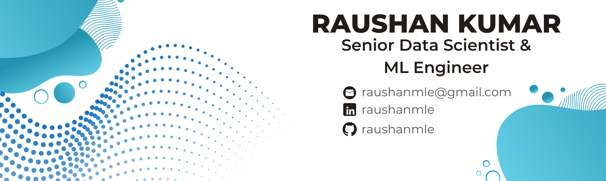
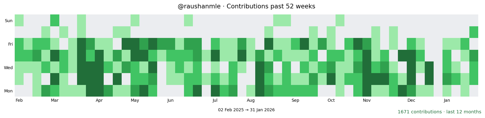

<div align="center">
  
  
  
  
  
  <p align="center">
    <a href="https://www.linkedin.com/in/raushanmle/">
      
    </a>
    <a href="https://github.com/raushanmle">
      
    </a>
    <a href="https://stackoverflow.com/users/12168683/raushan-kumar">
      
    </a>
    <a href="mailto:raushanmle@gmail.com">
      
    </a>
    <a href="tel:+918088566450">
      
    </a>
  </p>
  
  <p align="center">
    
    
    
  </p>
  
</div>

---

## 👨‍💻 About Me

Hi, I’m Raushan Kumar, an analytics professional with a solid background in data analysis and statistical methods. I excel at balancing multiple priorities, translating data into clear insights, and performing effectively in fast-paced environments. I offer strong problem-solving, planning, presentation, and people-management skills.

```python
class RaushanKumar:
    def __init__(self):
        self.role = "Senior Data Scientist & ML Engineer"
        self.company = "AB InBev"
        self.experience_years = 8.5
        self.location = "Bengaluru, India"
        
        self.core_expertise = [
            "Large Language Models (LLMs) & Generative AI",
            "Agentic AI Systems & Autonomous ML",
            "Production ML Pipelines & MLOps",
            "Predictive Modeling & Statistical Analysis",
            "NLP & Computer Vision"
        ]
        
        self.tech_stack = {
            "languages": ["Python", "SQL", "R", "Spark"],
            "genai": ["LangChain", "LangGraph", "RAG", "AutoGen", "OpenAI", "LlamaIndex"],
            "ml_frameworks": ["TensorFlow", "PyTorch", "Scikit-learn", "Hugging Face"],
            "mlops": ["Docker", "Azure ML", "Databricks", "CI/CD"],
            "databases": ["MS SQL", "MongoDB", "Hadoop", "Pinecone", "ChromaDB"],
            "cloud": ["Azure", "Databricks"],
            "visualization": ["Power BI", "Tableau", "Excel"]
        }
        
        self.impact = {
            "revenue_generated": "$80M+ revenue uplift",
            "efficiency_gains": "4x-10x process acceleration",
            "automation": "75-80% manual effort reduction",
            "certifications": "20+ Data Science certifications"
        }
    
me = RaushanKumar()
print(f"👋 Hi! I'm {me.role} at {me.company}")
print(f"💼 {me.experience_years}+ years transforming data into business value")
```

### 🎯 Professional Highlights

<table>
<tr>
<td width="50%">

**🤖 AI/ML Innovation**
- Developed LLM-based automation reducing manual effort by **80%** and time by **90%**
- Built RAG-based QA systems cutting onboarding time by **30%**
- Created GenAI visualization tools for strategic decision-making
- Achieved **$2B** revenue coverage with AI-powered recommendation systems

</td>
<td width="50%">

**📈 Business Impact**
- Generated **$80M** revenue uplift through ML algorithms
- Accelerated assortment optimization by **4x** (CatExpert.ai - AIM recognized)
- Improved process efficiency **10x** using Generative AI
- Drove **8.5%** growth through ML-powered marketing strategies

</td>
</tr>
</table>


---

## 🛠️ Tech Stack & Expertise

<div align="center">

### 🤖 Generative AI & LLMs


### 💻 Programming & ML Frameworks


### 🗄️ Databases & Storage


### ☁️ Cloud & MLOps


### 📊 Data & Visualization


### 🛠️ Tools & IDEs


</div>

---

## 📊 GitHub Stats

<!--START_SECTION:github-stats-->
<p align="center">
  
</p>

<div align="center">

| Metric | Value |
| --- | --- |
| Contributions (last 12 months) | 1716 |
| Contributions (2026) | 134 |
| Current streak | 0 days (—) |
| Longest streak | 10 days (2025-02-26 → 2025-03-07) |
| Best day | 39 on 2025-03-27 |

</div>

<p align="center"><sub>Last updated 2026-02-10 05:13 UTC · Source: GitHub API</sub></p>
<!--END_SECTION:github-stats-->


---

## 💼 Professional Journey

<table>
<tr>
  <td><b>🚀 Current</b></td>
  <td><b>Senior Data Scientist & ML Engineer</b> @ <a href="https://en.wikipedia.org/wiki/AB_InBev">AB InBev</a></td>
  <td><i>Oct 2023 - Present</i></td>
</tr>
<tr>
  <td><b>📊</b></td>
  <td><b>Data Scientist</b> @ <a href="https://en.wikipedia.org/wiki/AB_InBev">AB InBev</a></td>
  <td><i>Sept 2021 - Oct 2023</i></td>
</tr>
<tr>
  <td><b>📈</b></td>
  <td><b>Associate Data Scientist</b> @ <a href="https://en.wikipedia.org/wiki/AB_InBev">AB InBev</a></td>
  <td><i>Oct 2020 - Sept 2021</i></td>
</tr>
<tr>
  <td><b>🔍</b></td>
  <td><b>Lead Data Analyst</b> @ <a href="https://en.wikipedia.org/wiki/Amazon_(company)">Amazon</a></td>
  <td><i>Jan 2019 - Oct 2020</i></td>
</tr>
<tr>
  <td><b>📋</b></td>
  <td><b>Data Quality Analyst</b> @ <a href="https://en.wikipedia.org/wiki/Amazon_(company)">Amazon</a></td>
  <td><i>May 2017 - Jan 2019</i></td>
</tr>
</table>


---

## 🤝 Open to Collaborate On

<div align="center">

| 🎯 Domain | 💡 Focus Areas |
|-----------|----------------|
| 🤖 **LLMs & Generative AI** | Agentic AI systems, RAG pipelines, LLM fine-tuning, multimodal AI |
| 🚀 **Production ML Systems** | End-to-end MLOps, scalable ML pipelines, model deployment & monitoring |
| 📊 **Advanced Analytics** | Predictive modeling, optimization algorithms, statistical research |
| 🌐 **Full Stack ML Applications** | Data-driven web apps, ML-powered dashboards, API development |
| 📚 **Research & Innovation** | Applied ML research papers, novel algorithm development, open-source contributions |

</div>

---

## 🎓 Education & Certifications

**🎓 B.Tech in Electrical & Electronics Engineering**  
SRM University | 2013 - 2017 | GPA: 8.93/10

**📜 Certifications**
- 20+ Data Science & ML Certifications
- Specialized in LLMs, Deep Learning, Cloud Computing, and MLOps

---

<div align="center">

### 💭 Philosophy

*"Believe in yourself. Time keeps turning, and change is inevitable."*

**― An Optimistic Coder**


</div>
